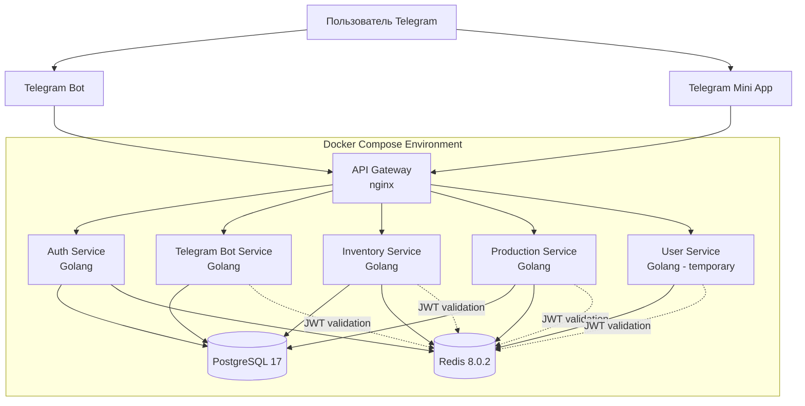
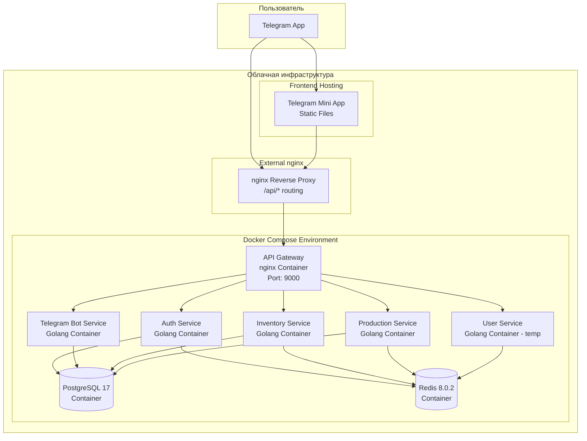
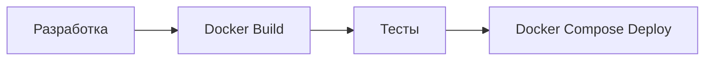

# Архитектура Shard Legends: Clan Wars

## Обзор

Shard Legends: Clan Wars - это многопользовательская стратегическая match-3 игра, реализованная как Telegram Mini App. На текущем этапе система проектируется как монолитное приложение с возможностью будущего разделения на микросервисы.

## Технологический стек

### Frontend
- **Платформа**: Telegram Mini App
- **Хостинг**: Firebase Hosting (планируется)
- **Технологии**: HTML5, CSS3, JavaScript/TypeScript
- **Фреймворк**: React/Vue.js (будет определен позже)
- **Telegram Web App SDK**: для интеграции с Telegram

### Backend
- **Язык**: Golang
- **База данных**: PostgreSQL 17
- **Кеш**: Redis 8.0.2
- **API**: RESTful API
- **Контейнеризация**: Docker
- **Оркестрация**: Docker Compose (текущий этап)

## Текущая архитектура

### Основные компоненты



### 1. API Gateway (nginx)

**Назначение:**
- Единая точка входа для всех API запросов
- Маршрутизация `/api/*` эндпоинтов к микросервисам
- Централизованное логирование API трафика
- Изоляция внутренних сервисов от внешнего доступа

**Конфигурация:**
- Порт: 8080 (внутри контейнера), 9000 (внешний)
- Маршруты: 
  - `/api/webhook` → telegram-bot-service:8080/webhook
  - `/api/auth` → auth-service:8080/auth
  - `/api/inventory` → inventory-service:8080/api/inventory
  - `/api/production` → production-service:8080/production
  - `/api/user` → user-service:8080/user
- Health check: `/health` (внутренний)

### 2. Telegram Bot Service (Golang)

**Ключевые возможности:**
- Webhook обработка Telegram обновлений через `/webhook`
- Команды запуска и управления Mini App
- Поддержка нескольких инстансов бота (dev/prod окружения)
- Автоматическое определение имени бота для Mini App ссылок
- Graceful shutdown при отключении

### 3. Auth Service (Golang)

**Назначение:**
- Аутентификация и авторизация пользователей Telegram Mini App
- Генерация и управление JWT токенами
- Регистрация новых пользователей
- Управление сессиями в Redis

**API эндпоинты:**
- `POST /auth` → Аутентификация через Telegram Web App данные
- `GET /health` → Проверка состояния сервиса

**Ключевые возможности:**
- Валидация Telegram Web App init data
- JWT токены с RSA подписью (срок жизни 24 часа)
- Автоматическая регистрация новых пользователей
- Управление активными/отозванными токенами в Redis
- Rate limiting для защиты от злоупотреблений

### 4. Inventory Service (Golang)

**Назначение:**
- Управление инвентарем пользователей и игровыми предметами
- Система классификаторов для справочных данных
- Учет остатков и операций с предметами
- Поддержка разделов инвентаря (базовый, фабричный, торговый)

**API эндпоинты:**
- `GET /inventory` → Получение инвентаря пользователя
- `POST /inventory/operations` → Операции с инвентарем (внутренний)
- `POST /inventory/reserve` → Резервирование для фабрики (внутренний)
- `POST /admin/inventory/adjust` → Административная корректировка
- `GET /health` → Проверка состояния сервиса

**Ключевые возможности:**
- Общий классификатор для справочных данных всей системы
- Система дневных остатков для оптимизации расчетов
- Поддержка атомарных операций с инвентарем
- Раздельный учет предметов по разделам инвентаря
- Протоколирование всех операций с предметами
- Интеграция с Production Service для резервирования материалов

### 5. Production Service (Golang)

**Назначение:**
- Управление производственными рецептами и заданиями
- Система фабрики с очередями производства
- Применение модификаторов и ускорителей
- Предрасчет результатов производства

**API эндпоинты:**
- `GET /recipes` → Получение производственных рецептов
- `GET /factory/queue` → Очередь производственных заданий
- `GET /factory/completed` → Завершенные задания для Claim
- `POST /factory/start` → Запуск нового производственного задания
- `POST /factory/claim` → Получение результатов производства
- `POST /factory/cancel` → Отмена задания
- `GET /health` → Проверка состояния сервиса

**Ключевые возможности:**
- Система производственных рецептов с входными/выходными предметами
- Управление производственными слотами через User Service
- Атомарное резервирование материалов через Inventory Service
- Предрасчет результатов с применением модификаторов
- Система лимитов производства (дневные, событийные)
- Интеграция с Event Service для событийных модификаторов (планируется)

**Технические характеристики:**
- Порт: 8080 (стандартный)
- База данных: PostgreSQL схема `production`
- Кеширование: Redis DB 2 + проверка JWT в DB 0

### 6. User Service (Golang) - временная версия

**Назначение:**
- Управление пользовательскими данными и профилями
- Предоставление информации о производственных слотах
- Модификаторы пользователя (VIP, уровень, достижения)

**API эндпоинты:**
- `GET /profile` → Профиль пользователя
- `GET /production-slots` → Производственные слоты пользователя
- `GET /internal/users/{user_id}/production-slots` → Слоты для Production Service
- `GET /internal/users/{user_id}/production-modifiers` → Модификаторы для Production Service
- `GET /health` → Проверка состояния сервиса

**Особенности временной версии:**
- Отсутствует собственная база данных
- Возвращает моковые данные для интеграции
- VIP статус генерируется случайно (30% вероятность)
- Фиксированные значения: 2 универсальных производственных слота
- Нулевые модификаторы для всех пользователей

**Технические характеристики:**
- Порт: 8080 (стандартный)
- База данных: отсутствует (временная версия)
- Кеширование: Redis DB 3 + проверка JWT в DB 0

### 7. Telegram Mini App (Frontend)

**Ключевые возможности:**
- Интеграция с Telegram через Web App SDK
- Авторизация через Telegram ID
- Match-3 игровая механика
- Клановая система
- Responsive дизайн для мобильных устройств

### 8. Game API (Golang) - планируется

**Основная функциональность:**
- RESTful API для всех игровых операций
- Аутентификация и авторизация
- Игровая логика match-3
- Система кланов и войн
- Управление пользователями и достижениями

## Маршрутизация API

### Внешний доступ
Все API запросы проходят через единую точку входа:
```
https://domain.com/api/* → nginx → API Gateway:9000/* → микросервисы:8080/*
```

### Текущие маршруты
- `/api/webhook` → telegram-bot-service:8080/webhook
- `/api/auth` → auth-service:8080/auth
- `/api/inventory` → inventory-service:8080/api/inventory
- `/api/production` → production-service:8080/production
- `/api/user` → user-service:8080/user

### Добавление новых сервисов
1. Создать новый микросервис на порту 8080
2. Добавить upstream в `api-gateway/nginx.conf`
3. Добавить location rule для маршрутизации
4. Пересобрать API Gateway

## Планируемые сервисы (будущее разделение)

При росте системы планируется выделение следующих сервисов:

#### Game Service
- Match-3 игровая логика
- Управление игровыми сессиями
- Валидация ходов игроков

#### User Service (полная версия)
- Расширение текущей временной версии с добавлением PostgreSQL
- Профили игроков (расширенные данные сверх базовой авторизации)
- Реальная система VIP, уровней и достижений
- История игр и прогресс пользователей
- Система производственных слотов с возможностью улучшения

#### Clan Service
- Создание и управление кланами
- Клановые войны
- Рейтинги и лидерборды

#### Battle Service
- Матчмейкинг для PvP
- Расчет результатов боев
- История сражений

#### Economy Service
- Игровая валюта и ресурсы
- Магазин и покупки
- Система наград

#### Event Service
- Управление событийными модификаторами для производства
- Сезонные события и временные бонусы
- Система лунных циклов и серверных бафов
- Интеграция с Production Service для применения модификаторов

### 9. Хранилище данных

#### PostgreSQL 17
Основная база данных с разделением по схемам:
- **auth.*** - Пользователи (базовые данные авторизации в auth-service)
- **inventory.*** - Инвентарь и предметы (inventory-service: предметы, остатки, операции)
- **production.*** - Производственные данные (production-service: рецепты, задания, результаты)
- **classifiers.*** - Общие справочные данные для всех сервисов
- **users.*** - Профили игроков (расширенные данные в user-service, планируется)
- **clans.*** - Клановые данные (планируется)
- **games.*** - История игр и достижения (планируется)
- **economy.*** - Экономические транзакции (планируется)

**Новые возможности PostgreSQL 17:**
- Улучшенная производительность JSON операций
- Поддержка UUID v7 для лучшей сортировки по времени
- Оптимизированный планировщик запросов
- Улучшенные возможности партиционирования

#### Redis 8.0.2
Кеширование и временные данные с разделением по базам:

**Распределение Redis баз по сервисам:**
- **DB 0 (Auth Service)**: JWT токены (активные и отозванные), проверка токенов для всех сервисов
- **DB 1 (Inventory Service)**: Справочные данные (классификаторы и каталог предметов), актуальные остатки инвентаря
- **DB 2 (Production Service)**: Кеширование рецептов, производственные очереди, временные данные заданий
- **DB 3 (User Service)**: Пользовательские профили, модификаторы, слоты (временная версия)
- **DB 4-15**: Зарезервированы для будущих сервисов

**Общие данные:**
- Сессии пользователей
- Активные игровые состояния
- Очереди матчмейкинга
- Часто запрашиваемые данные

**Новые возможности Redis 8.0.2:**
- Значительно улучшенная производительность операций
- Оптимизированное управление памятью
- Новые возможности Redis Modules
- Улучшенная репликация и кластеризация

## Диаграмма развертывания



## API и документация

### Спецификации
- **База данных**: Структура описана в `docs/architecture/database.dbml` (DBML формат)
- **API эндпоинты**: Полное описание в `docs/architecture/openapi.yml` (OpenAPI 3.0)
- **Telegram Bot**: Детальная спецификация в `docs/specs/telegram-bot-service.md`

## Безопасность

### Аутентификация и авторизация
- **Auth Service** для централизованной авторизации
- Telegram Web App валидация через `initData` заголовки
- JWT токены с RSA подписью (срок жизни 24 часа)
- Управление активными/отозванными токенами в Redis
- Автоматическая регистрация новых пользователей
- Rate limiting для защиты endpoints

### Защита API
- Rate limiting на уровне пользователя
- CORS политики
- Input валидация
- SQL injection защита
- XSS предотвращение

### Защита данных
- Шифрование sensitive данных
- HTTPS для всех коммуникаций
- Безопасное хранение токенов
- Регулярные бекапы БД

## Масштабирование

### Текущий этап
- **API Gateway архитектура** - единая точка входа для микросервисов
- **Docker Compose** для простого развертывания
- **Микросервисная готовность** - изоляция сервисов через API Gateway
- **Вертикальное масштабирование** ресурсов

### Горизонтальное масштабирование (готово)
API Gateway позволяет легко масштабировать любой микросервис:

```yaml
# Пример масштабирования telegram-bot-service
telegram-bot-service-1:
  # ... config
telegram-bot-service-2:  
  # ... config
telegram-bot-service-3:
  # ... config

# API Gateway автоматически распределит нагрузку
```

### Будущие планы масштабирования
- **Kubernetes** для оркестрации контейнеров
- **Service mesh** (Istio) для межсервисного взаимодействия
- **Load balancing** на уровне API Gateway
- **Auto-scaling** на базе метрик нагрузки
- **CDN** для статических ресурсов
- **WebSocket Gateway** для real-time функций

## Мониторинг и логирование

### Метрики
- Prometheus для сбора метрик
- Grafana для визуализации
- Custom игровые метрики
- Performance monitoring

### Логирование
- Centralized logging (ELK stack)
- Structured logging
- Error tracking (Sentry)
- Audit logs для критических операций

## Развертывание

### Текущий подход


### Окружения
- **Development**: Локальная разработка с Docker Compose
- **Staging**: Тестовая среда (планируется)
- **Production**: Продуктивная среда (планируется)

### Планируемый CI/CD pipeline
1. Code commit → Git
2. Automated tests → GitHub Actions
3. Build Docker images
4. Deploy via Docker Compose
5. Integration tests
6. Production deployment (в будущем)

## Эволюция архитектуры  

### Этап 1: Монолит (завершен)
- Одно приложение на Golang
- Docker Compose для развертывания
- Прямое подключение сервисов

### Этап 2: API Gateway архитектура (текущий)
- **API Gateway** как единая точка входа
- **Микросервисная изоляция** - telegram-bot-service, ping-service
- **Готовность к масштабированию** - горизонтальное масштабирование готово
- **Централизованное логирование** API запросов

### Этап 3: Полные микросервисы (планируется)
- Разделение Game API на отдельные сервисы
- **Service Discovery** для автоматического обнаружения сервисов
- **Circuit Breaker** паттерн для устойчивости
- **Distributed Tracing** для отладки

### Этап 4: Cloud Native (будущее)
- **Kubernetes** оркестрация
- **Service Mesh** (Istio) для безопасности и мониторинга
- **Event-driven архитектура** с очередями сообщений
- **Serverless функции** для обработки событий

### Этап 5: Advanced Features (дальняя перспектива)
- **WebSocket Gateway** для real-time обновлений
- **GraphQL Federation** для объединения API
- **Event Sourcing** для игровых событий
- **Machine Learning** для балансировки и матчмейкинга

### Этап 4: Продвинутые функции (дальнесрочные планы)
- **Blockchain интеграция** для NFT и криптовалют
- **Микрофронтенды** для модульности
- **Advanced analytics** и метрики

## Проектные артефакты

### Обязательные файлы документации
- `docs/architecture/database.dbml` - Структура базы данных в DBML формате
- `docs/architecture/openapi.yml` - API спецификация в OpenAPI 3.0 формате
- `docs/architecture/architecture.md` - Данный архитектурный документ (общая архитектура)
- `docs/architecture/deployment-strategy.md` - Стратегия развертывания
- `docs/architecture/migration-strategy.md` - Стратегия миграций БД