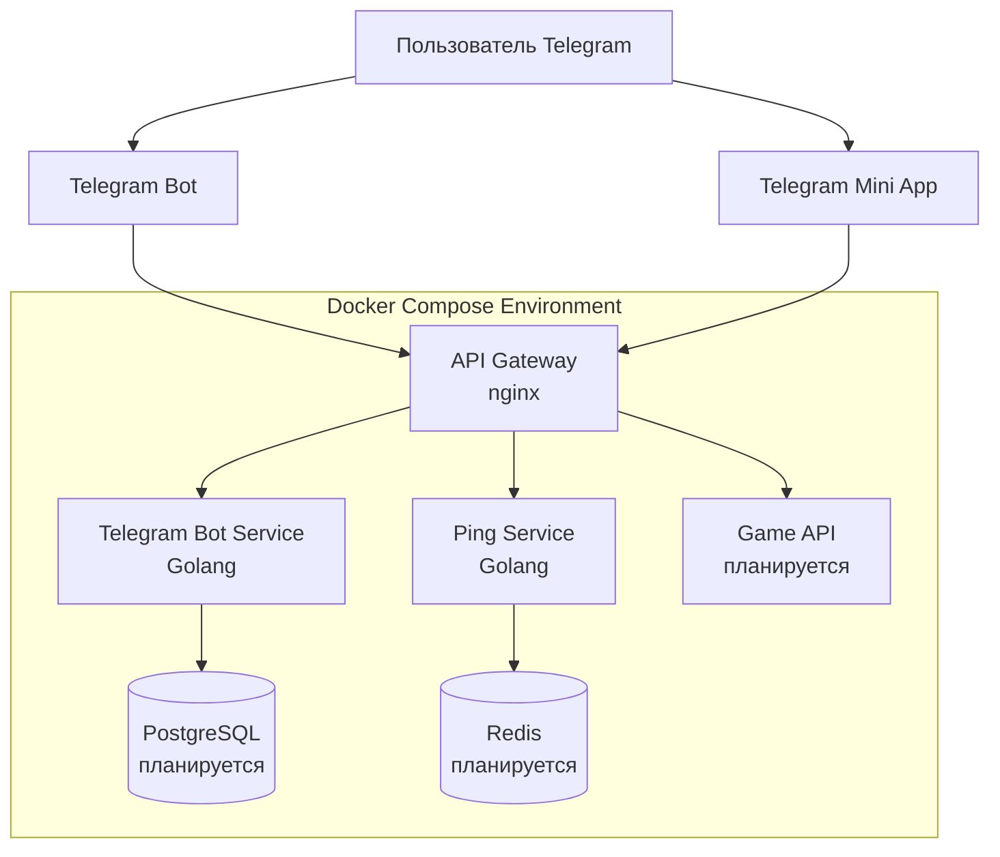
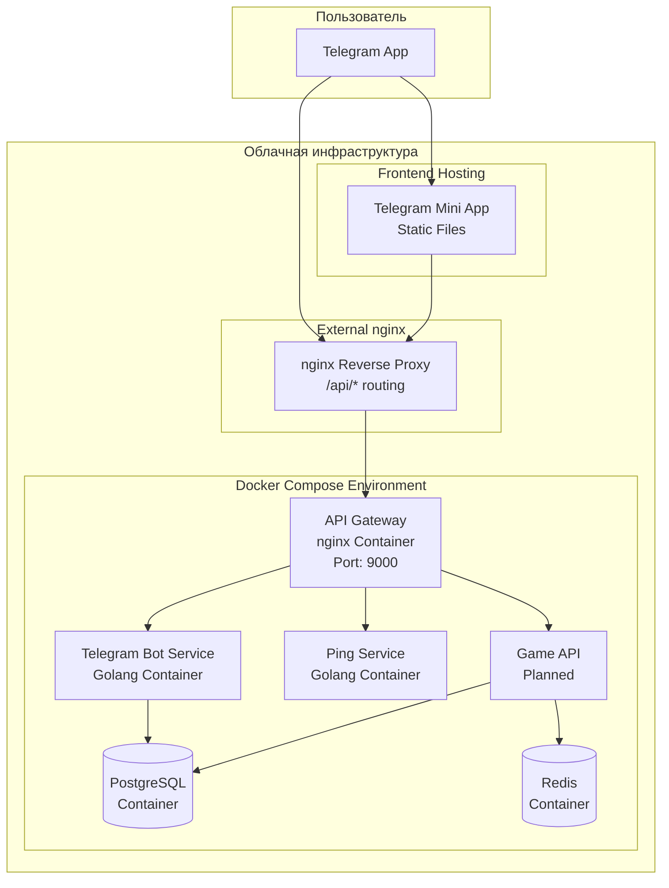
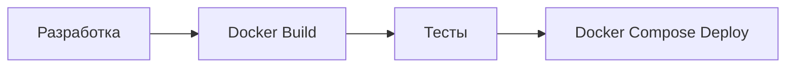

# Архитектура Shard Legends: Clan Wars

## Обзор

Shard Legends: Clan Wars - это многопользовательская стратегическая match-3 игра, реализованная как Telegram Mini App. На текущем этапе система проектируется как монолитное приложение с возможностью будущего разделения на микросервисы.

## Технологический стек

### Frontend
- **Платформа**: Telegram Mini App
- **Хостинг**: Firebase Hosting (планируется)
- **Технологии**: HTML5, CSS3, JavaScript/TypeScript
- **Фреймворк**: React/Vue.js (будет определен позже)
- **Telegram Web App SDK**: для интеграции с Telegram

### Backend
- **Язык**: Golang
- **База данных**: PostgreSQL (планируется)
- **Кеш**: Redis (планируется)
- **API**: RESTful API
- **Контейнеризация**: Docker
- **Оркестрация**: Docker Compose (текущий этап)

## Текущая архитектура

### Основные компоненты



### 1. API Gateway (nginx)

**Назначение:**
- Единая точка входа для всех API запросов
- Маршрутизация `/api/*` эндпоинтов к микросервисам
- Централизованное логирование API трафика
- Изоляция внутренних сервисов от внешнего доступа

**Конфигурация:**
- Порт: 8080 (внутри контейнера), 9000 (внешний)
- Маршруты: `/api/ping` → ping-service, `/api/webhook` → telegram-bot-service
- Health check: `/health` (внутренний)

### 2. Telegram Bot Service (Golang)

**Ключевые возможности:**
- Webhook обработка Telegram обновлений через `/webhook`
- Команды запуска и управления Mini App
- Поддержка нескольких инстансов бота (dev/prod окружения)
- Автоматическое определение имени бота для Mini App ссылок
- Graceful shutdown при отключении

### 3. Ping Service (Golang)

**Назначение:**
- Тестовый микросервис для проверки работоспособности
- Демонстрация архитектуры микросервисов
- Health check эндпоинт для мониторинга

**API эндпоинты:**
- `GET /ping` → `{"message": "pong"}`

### 4. Telegram Mini App (Frontend)

**Ключевые возможности:**
- Интеграция с Telegram через Web App SDK
- Авторизация через Telegram ID
- Match-3 игровая механика
- Клановая система
- Responsive дизайн для мобильных устройств

### 5. Game API (Golang) - планируется

**Основная функциональность:**
- RESTful API для всех игровых операций
- Аутентификация и авторизация
- Игровая логика match-3
- Система кланов и войн
- Управление пользователями и достижениями

## Маршрутизация API

### Внешний доступ
Все API запросы проходят через единую точку входа:
```
https://domain.com/api/* → nginx → API Gateway:9000/* → микросервисы:8080/*
```

### Текущие маршруты
- `/api/ping` → ping-service:8080/ping
- `/api/webhook` → telegram-bot-service:8080/webhook

### Добавление новых сервисов
1. Создать новый микросервис на порту 8080
2. Добавить upstream в `api-gateway/nginx.conf`
3. Добавить location rule для маршрутизации
4. Пересобрать API Gateway

## Планируемые сервисы (будущее разделение)

При росте системы планируется выделение следующих сервисов:

#### Game Service
- Match-3 игровая логика
- Управление игровыми сессиями
- Валидация ходов игроков

#### User Service  
- Регистрация/авторизация через Telegram
- Профили игроков
- Статистика и достижения

#### Clan Service
- Создание и управление кланами
- Клановые войны
- Рейтинги и лидерборды

#### Battle Service
- Матчмейкинг для PvP
- Расчет результатов боев
- История сражений

#### Economy Service
- Игровая валюта и ресурсы
- Магазин и покупки
- Система наград

### 5. Хранилище данных (планируется)

#### PostgreSQL
Основная база данных для хранения:
- Пользователи и профили
- Клановые данные
- История игр и достижения
- Экономические транзакции

#### Redis
Кеширование и временные данные:
- Сессии пользователей
- Активные игровые состояния
- Очереди матчмейкинга
- Часто запрашиваемые данные

## Диаграмма развертывания



## API и документация

### Спецификации
- **База данных**: Структура описана в `docs/architecture/database.dbml` (DBML формат)
- **API эндпоинты**: Полное описание в `docs/architecture/openapi.yml` (OpenAPI 3.0)
- **Telegram Bot**: Детальная спецификация в `docs/specs/telegram-bot-service.md`

## Безопасность

### Аутентификация и авторизация
- Telegram Web App валидация через `initData`
- JWT токены для API запросов
- Refresh token механизм
- Role-based access control (RBAC)

### Защита API
- Rate limiting на уровне пользователя
- CORS политики
- Input валидация
- SQL injection защита
- XSS предотвращение

### Защита данных
- Шифрование sensitive данных
- HTTPS для всех коммуникаций
- Безопасное хранение токенов
- Регулярные бекапы БД

## Масштабирование

### Текущий этап
- **API Gateway архитектура** - единая точка входа для микросервисов
- **Docker Compose** для простого развертывания
- **Микросервисная готовность** - изоляция сервисов через API Gateway
- **Вертикальное масштабирование** ресурсов

### Горизонтальное масштабирование (готово)
API Gateway позволяет легко масштабировать любой микросервис:

```yaml
# Пример масштабирования telegram-bot-service
telegram-bot-service-1:
  # ... config
telegram-bot-service-2:  
  # ... config
telegram-bot-service-3:
  # ... config

# API Gateway автоматически распределит нагрузку
```

### Будущие планы масштабирования
- **Kubernetes** для оркестрации контейнеров
- **Service mesh** (Istio) для межсервисного взаимодействия
- **Load balancing** на уровне API Gateway
- **Auto-scaling** на базе метрик нагрузки
- **CDN** для статических ресурсов
- **WebSocket Gateway** для real-time функций

## Мониторинг и логирование

### Метрики
- Prometheus для сбора метрик
- Grafana для визуализации
- Custom игровые метрики
- Performance monitoring

### Логирование
- Centralized logging (ELK stack)
- Structured logging
- Error tracking (Sentry)
- Audit logs для критических операций

## Развертывание

### Текущий подход


### Окружения
- **Development**: Локальная разработка с Docker Compose
- **Staging**: Тестовая среда (планируется)
- **Production**: Продуктивная среда (планируется)

### Планируемый CI/CD pipeline
1. Code commit → Git
2. Automated tests → GitHub Actions
3. Build Docker images
4. Deploy via Docker Compose
5. Integration tests
6. Production deployment (в будущем)

## Эволюция архитектуры  

### Этап 1: Монолит (завершен)
- Одно приложение на Golang
- Docker Compose для развертывания
- Прямое подключение сервисов

### Этап 2: API Gateway архитектура (текущий)
- **API Gateway** как единая точка входа
- **Микросервисная изоляция** - telegram-bot-service, ping-service
- **Готовность к масштабированию** - горизонтальное масштабирование готово
- **Централизованное логирование** API запросов

### Этап 3: Полные микросервисы (планируется)
- Разделение Game API на отдельные сервисы
- **Service Discovery** для автоматического обнаружения сервисов
- **Circuit Breaker** паттерн для устойчивости
- **Distributed Tracing** для отладки

### Этап 4: Cloud Native (будущее)
- **Kubernetes** оркестрация
- **Service Mesh** (Istio) для безопасности и мониторинга
- **Event-driven архитектура** с очередями сообщений
- **Serverless функции** для обработки событий

### Этап 5: Advanced Features (дальняя перспектива)
- **WebSocket Gateway** для real-time обновлений
- **GraphQL Federation** для объединения API
- **Event Sourcing** для игровых событий
- **Machine Learning** для балансировки и матчмейкинга

### Этап 4: Продвинутые функции (дальнесрочные планы)
- **Blockchain интеграция** для NFT и криптовалют
- **Микрофронтенды** для модульности
- **Advanced analytics** и метрики

## Проектные артефакты

### Обязательные файлы документации
- `docs/architecture/database.dbml` - Структура базы данных в DBML формате
- `docs/architecture/openapi.yml` - API спецификация в OpenAPI 3.0 формате
- `docs/architecture/architecture.md` - Данный архитектурный документ (общая архитектура)
- `docs/architecture/deployment-strategy.md` - Стратегия развертывания
- `docs/architecture/migration-strategy.md` - Стратегия миграций БД