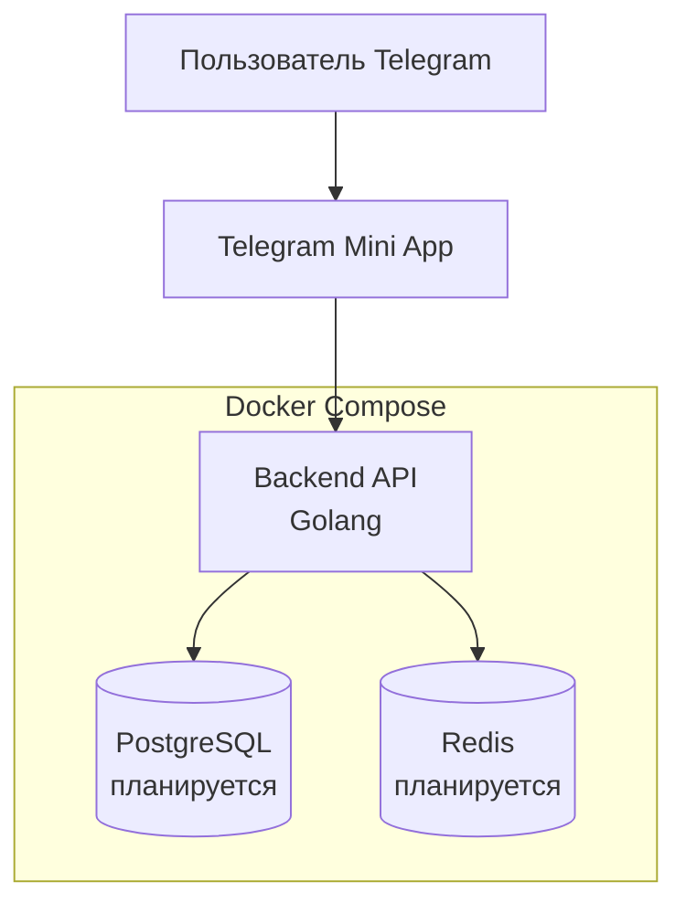
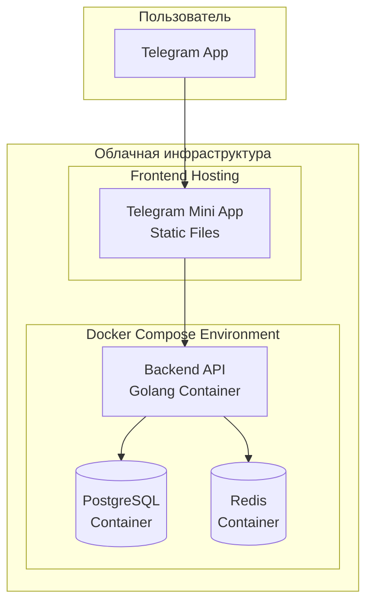
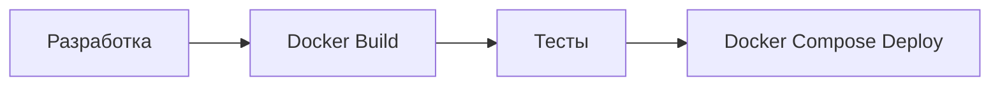

# Архитектура Shard Legends: Clan Wars

## Обзор

Shard Legends: Clan Wars - это многопользовательская стратегическая match-3 игра, реализованная как Telegram Mini App. На текущем этапе система проектируется как монолитное приложение с возможностью будущего разделения на микросервисы.

## Технологический стек

### Frontend
- **Платформа**: Telegram Mini App
- **Хостинг**: Firebase Hosting (планируется)
- **Технологии**: HTML5, CSS3, JavaScript/TypeScript
- **Фреймворк**: React/Vue.js (будет определен позже)
- **Telegram Web App SDK**: для интеграции с Telegram

### Backend
- **Язык**: Golang
- **База данных**: PostgreSQL (планируется)
- **Кеш**: Redis (планируется)
- **API**: RESTful API
- **Контейнеризация**: Docker
- **Оркестрация**: Docker Compose (текущий этап)

## Текущая архитектура

### Основные компоненты

### 1. Telegram Mini App (Frontend)

**Ключевые возможности:**
- Интеграция с Telegram через Web App SDK
- Авторизация через Telegram ID
- Match-3 игровая механика
- Клановая система
- Responsive дизайн для мобильных устройств

### 2. Backend Application (Golang)

**Основная функциональность:**
- RESTful API для всех игровых операций
- Аутентификация и авторизация
- Игровая логика match-3
- Система кланов и войн
- Управление пользователями и достижениями

### 3. Планируемые сервисы (будущее разделение)

При росте системы планируется выделение следующих сервисов:

#### Game Service
- Match-3 игровая логика
- Управление игровыми сессиями
- Валидация ходов игроков

#### User Service  
- Регистрация/авторизация через Telegram
- Профили игроков
- Статистика и достижения

#### Clan Service
- Создание и управление кланами
- Клановые войны
- Рейтинги и лидерборды

#### Battle Service
- Матчмейкинг для PvP
- Расчет результатов боев
- История сражений

#### Economy Service
- Игровая валюта и ресурсы
- Магазин и покупки
- Система наград

### 4. Хранилище данных (планируется)

#### PostgreSQL
Основная база данных для хранения:
- Пользователи и профили
- Клановые данные
- История игр и достижения
- Экономические транзакции

#### Redis
Кеширование и временные данные:
- Сессии пользователей
- Активные игровые состояния
- Очереди матчмейкинга
- Часто запрашиваемые данные

## Диаграмма развертывания

## API и документация

### Спецификации
- **База данных**: Структура описана в `docs/architecture/database.dbml` (DBML формат)
- **API эндпоинты**: Полное описание в `docs/architecture/openapi.yml` (OpenAPI 3.0)

## Безопасность

### Аутентификация и авторизация
- Telegram Web App валидация через `initData`
- JWT токены для API запросов
- Refresh token механизм
- Role-based access control (RBAC)

### Защита API
- Rate limiting на уровне пользователя
- CORS политики
- Input валидация
- SQL injection защита
- XSS предотвращение

### Защита данных
- Шифрование sensitive данных
- HTTPS для всех коммуникаций
- Безопасное хранение токенов
- Регулярные бекапы БД

## Масштабирование (планы)

### Текущий этап
- Docker Compose для простого развертывания
- Вертикальное масштабирование ресурсов
- Базовая оптимизация запросов к БД

### Будущие планы масштабирования
- Переход на Kubernetes для оркестрации
- Разделение на микросервисы
- Горизонтальное масштабирование
- Load balancing между инстансами
- CDN для статических ресурсов
- WebSocket для real-time функций

## Мониторинг и логирование

### Метрики
- Prometheus для сбора метрик
- Grafana для визуализации
- Custom игровые метрики
- Performance monitoring

### Логирование
- Centralized logging (ELK stack)
- Structured logging
- Error tracking (Sentry)
- Audit logs для критических операций

## Развертывание

### Текущий подход

### Окружения
- **Development**: Локальная разработка с Docker Compose
- **Staging**: Тестовая среда (планируется)
- **Production**: Продуктивная среда (планируется)

### Планируемый CI/CD pipeline
1. Code commit → Git
2. Automated tests → GitHub Actions
3. Build Docker images
4. Deploy via Docker Compose
5. Integration tests
6. Production deployment (в будущем)

## Эволюция архитектуры  

### Этап 1: MVP (текущий)
- Монолитное приложение на Golang
- Docker Compose для развертывания
- Базовая функциональность игры

### Этап 2: Масштабирование
- Разделение на микросервисы
- Kubernetes оркестрация
- Горизонтальное масштабирование

### Этап 3: Дополнительные возможности
- **WebSocket интеграция** для real-time обновлений
- **GraphQL** как альтернатива REST
- **Event Sourcing** для игровых событий
- **Machine Learning** для балансировки и матчмейкинга

### Этап 4: Продвинутые функции (дальнесрочные планы)
- **Blockchain интеграция** для NFT и криптовалют
- **Микрофронтенды** для модульности
- **Advanced analytics** и метрики

## Проектные артефакты

### Обязательные файлы документации
- `docs/architecture/database.dbml` - Структура базы данных в DBML формате
- `docs/architecture/openapi.yml` - API спецификация в OpenAPI 3.0 формате
- `docs/architecture/architecture.md` - Данный архитектурный документ (общая архитектура)
- `docs/architecture/deployment-strategy.md` - Стратегия развертывания
- `docs/architecture/migration-strategy.md` - Стратегия миграций БД