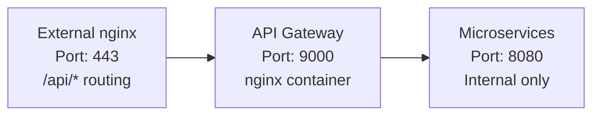

# Стратегия развертывания

## Обзор

Стратегия развертывания Shard Legends: Clan Wars базируется на контейнеризации с Docker и оркестрации через Docker Compose. Ключевым элементом архитектуры является API Gateway, обеспечивающий единую точку входа для всех микросервисов.

## Архитектура с API Gateway

### Текущая инфраструктура



### Преимущества внедрения

#### 1. Единая точка входа
- Упрощение внешней nginx конфигурации
- Один порт (9000) вместо множества портов для каждого сервиса
- Централизованная маршрутизация API запросов

#### 2. Изоляция микросервисов
- Микросервисы не имеют внешних портов
- Доступ только через API Gateway
- Повышенная безопасность

#### 3. Масштабируемость
- Легкое добавление новых микросервисов
- Горизонтальное масштабирование через балансировку нагрузки
- Готовность к Service Mesh архитектуре

#### 4. Централизованное логирование
- Все API запросы логируются в API Gateway
- Единый формат логов для всех сервисов
- Удобный мониторинг трафика

## Окружения развертывания

### Development (DEV)
- **Домен**: `dev.slcw.dimlight.online`, `dev-dim.slcw.dimlight.online`, `dev-forly.slcw.dimlight.online`
- **API Gateway порт**: 9000
- **Назначение**: Активная разработка, тестирование новых функций
- **Особенности**: 
  - Поддержка нескольких telegram-bot инстансов
  - Docker Compose с профилями для различных конфигураций
  - Hot reload для frontend разработки

### Staging (STAGE)
- **Домен**: `stage.slcw.dimlight.online`
- **API Gateway порт**: 7000
- **Назначение**: Предпродуктивное тестирование
- **Особенности**: Копия production окружения для финального тестирования

### Production (PROD)
- **Домен**: `slcw.dimlight.online`
- **API Gateway порт**: 5000
- **Назначение**: Продуктивная среда для пользователей
- **Особенности**: Высокая доступность, мониторинг, резервное копирование

## Маршрутизация запросов

### Схема обработки запроса
1. **Client**: `https://domain.com/api/ping`
2. **External nginx**: перенаправляет на `http://127.0.0.1:9000/ping` (убирает `/api`)
3. **API Gateway**: получает `/ping`, перенаправляет на `http://ping-service:8080/ping`
4. **ping-service**: обрабатывает запрос, возвращает `{"message": "pong"}`

### Важные моменты
- External nginx **убирает префикс `/api`** при проксировании
- API Gateway работает **без префикса `/api`**
- Микросервисы получают **чистые пути** (`/ping`, `/webhook`)

### Текущие маршруты
- `/api/ping` → ping-service:8080/ping
- `/api/webhook` → telegram-bot-service:8080/webhook

## Docker Compose конфигурация

### Структура проекта
```
deploy/
  dev/
    docker-compose.yml
    .env
    api-gateway/
      Dockerfile
      nginx.conf
    frontend.Dockerfile
  stage/
    docker-compose.yml
  prod/
    docker-compose.yml
```

### API Gateway сервис
```yaml
api-gateway:
  build: ./api-gateway
  container_name: slcw-api-gateway-dev
  ports:
    - "127.0.0.1:9000:8080"  # Единственный внешний порт
  networks:
    - slcw-dev
  depends_on:
    - ping-service
    - telegram-bot-service
```

### Микросервисы (без внешних портов)
```yaml
ping-service:
  build: ../../services/ping-service
  container_name: slcw-ping-service-dev
  # Нет внешних портов - только внутренние
  networks:
    - slcw-dev

telegram-bot-service:
  build: ../../services/telegram-bot-service
  container_name: slcw-telegram-bot-dev
  # Нет внешних портов - только внутренние
  networks:
    - slcw-dev
```

## Добавление новых микросервисов

### 1. Создание сервиса
```yaml
# docker-compose.yml
new-service:
  build: ../../services/new-service
  container_name: slcw-new-service-dev
  # Без внешних портов
  networks:
    - slcw-dev
```

### 2. Обновление API Gateway
```nginx
# api-gateway/nginx.conf
upstream new_service {
    server new-service:8080;
}

# В server блоке
location /newapi {
    proxy_pass http://new_service/newapi;
}
```

### 3. Пересборка и запуск
```bash
docker-compose build api-gateway
docker-compose up -d
```

## Процесс развертывания

### 1. Локальная разработка
```bash
# Клонирование репозитория
git clone https://github.com/shard-legends/shard-legends.git
cd shard-legends/deploy/dev

# Настройка окружения
cp .env.example .env
# Редактирование .env файла

# Запуск всех сервисов
docker-compose up -d

# Проверка работоспособности
curl http://localhost:9000/health
```

### 2. CI/CD Pipeline (планируется)


### 3. Обновление production
```bash
# На production сервере
cd /opt/shard-legends/deploy/prod
git pull
docker-compose pull
docker-compose up -d --remove-orphans
```

## Мониторинг и отладка

### Логи
```bash
# API Gateway логи
docker logs slcw-api-gateway-dev

# Логи конкретного сервиса
docker logs slcw-telegram-bot-dev

# Следить за логами в реальном времени
docker logs -f slcw-api-gateway-dev
```

### Health checks
- **API Gateway**: `http://localhost:9000/health`
- **Микросервисы**: доступны только для Docker health checks

### Проверка маршрутизации
```bash
# Прямой доступ к API Gateway
curl http://localhost:9000/ping
curl http://localhost:9000/ | jq .

# Через внешний nginx
curl https://dev.slcw.dimlight.online/api/ping
```

## Безопасность

### Изоляция сервисов
- Микросервисы доступны только внутри Docker сети
- Нет прямого внешнего доступа к микросервисам
- Все запросы проходят через API Gateway

### SSL/TLS
- Сертификаты Let's Encrypt на внешнем nginx
- Внутренний трафик в Docker сети без шифрования
- Планируется mTLS для межсервисной коммуникации

### Secrets Management
- Переменные окружения через `.env` файлы
- Планируется интеграция с HashiCorp Vault
- Ротация токенов и ключей

## Масштабирование

### Вертикальное масштабирование
```yaml
# docker-compose.yml
services:
  api-gateway:
    deploy:
      resources:
        limits:
          cpus: '2'
          memory: 512M
        reservations:
          cpus: '1'
          memory: 256M
```

### Горизонтальное масштабирование
```yaml
# Несколько инстансов telegram-bot-service
telegram-bot-1:
  build: ../../services/telegram-bot-service
  # ... config

telegram-bot-2:
  build: ../../services/telegram-bot-service
  # ... config

# API Gateway автоматически распределит нагрузку
```

## Резервное копирование

### Стратегия бэкапов
- **База данных**: Ежедневные дампы PostgreSQL
- **Конфигурация**: Git репозиторий
- **Логи**: Ротация и архивация через logrotate
- **Volumes**: snapshot'ы Docker volumes

### Восстановление
```bash
# Восстановление из бэкапа
docker-compose down
# Восстановление volumes из бэкапа
docker-compose up -d
```

## Планы развития

### Краткосрочные (1-2 месяца)
- Добавление rate limiting в API Gateway
- Метрики Prometheus для мониторинга
- CORS конфигурация для безопасности
- Автоматизация CI/CD через GitHub Actions

### Среднесрочные (3-6 месяцев)
- Service Discovery для автоматического обнаружения сервисов
- Circuit Breaker паттерн для устойчивости
- Distributed Tracing (Jaeger/Zipkin)
- Переход на Docker Swarm для оркестрации

### Долгосрочные (6+ месяцев)
- Переход на Kubernetes с Ingress Controller
- Service Mesh (Istio) для продвинутой маршрутизации
- API versioning и Blue-Green deployments
- Multi-region развертывание