# Production Task Atomic Creation - Sequence Diagrams

## Overview

This document describes the sequence diagrams for atomic production task creation and inventory reservation using the Saga pattern.

## Current Implementation (Problematic)

```mermaid
sequenceDiagram
    participant Client as Frontend Client
    participant ProdSvc as Production Service
    participant DB as PostgreSQL
    participant InvSvc as Inventory Service
    
    Client->>ProdSvc: POST /production/factory/start
    
    Note over ProdSvc: Current Implementation (Non-Atomic)
    ProdSvc->>DB: BEGIN TRANSACTION
    ProdSvc->>DB: INSERT production_task (status=PENDING)
    ProdSvc->>DB: INSERT task_output_items
    ProdSvc->>DB: COMMIT
    
    ProdSvc->>InvSvc: POST /inventory/reserve
    alt Inventory Success
        InvSvc-->>ProdSvc: 200 OK
        ProdSvc-->>Client: 201 Task Created
    else Inventory Failure
        InvSvc-->>ProdSvc: 4xx/5xx Error
        Note over ProdSvc: Weak Compensation
        ProdSvc->>DB: UPDATE task status=FAILED
        ProdSvc-->>Client: 400/500 Error
        Note right of DB: 🚨 Task remains in DB!<br/>Inventory not reserved!
    end
```



**Problems:**
- Task exists in database even if inventory reservation fails
- No proper cleanup of failed tasks
- Data inconsistency between Production and Inventory services

## Proposed Solution: Saga Pattern


## Edge Case: Network Failure After Reservation

```mermaid
sequenceDiagram
    participant Client as Frontend Client
    participant ProdSvc as Production Service
    participant DB as PostgreSQL
    participant InvSvc as Inventory Service
    
    Client->>ProdSvc: POST /production/factory/start
    
    Note over ProdSvc: Phase 1: Draft Task Creation
    ProdSvc->>DB: INSERT task (status=DRAFT)
    
    Note over ProdSvc: Phase 2: Inventory Reservation
    ProdSvc->>InvSvc: POST /inventory/reserve
    InvSvc-->>ProdSvc: 200 OK (reservation successful)
    
    Note over ProdSvc: Phase 3: Confirmation
    ProdSvc->>DB: UPDATE status=PENDING
    Note over DB,ProdSvc: 💥 Network failure!<br/>Update fails
    
    Note over ProdSvc: Compensation Actions
    ProdSvc->>InvSvc: POST /inventory/return-reserve
    ProdSvc->>InvSvc: operationID: task.ID
    InvSvc-->>ProdSvc: 200 OK (reservation returned)
    
    ProdSvc->>DB: DELETE production_task
    ProdSvc-->>Client: 500 Internal Server Error
    
    Note right of DB: ✅ Consistent state restored<br/>No leaked reservations
```



## Background Cleanup Process


## Idempotency Handling


## Metrics and Monitoring

Key metrics to track the health of the atomic creation process:

- `production_saga_duration_seconds` - Total time for complete saga
- `production_saga_failures_total{phase="draft|reservation|confirmation"}`
- `production_compensation_actions_total{type="delete_task|return_reservation"}`
- `production_orphaned_tasks_cleaned_total`
- `production_idempotency_hits_total`

## Implementation Requirements

### Database Changes

```sql
-- Add DRAFT status to enum
ALTER TYPE task_status ADD VALUE 'DRAFT';

-- Index for cleanup operations
CREATE INDEX idx_production_tasks_draft_cleanup 
ON production_tasks(status, created_at) 
WHERE status = 'DRAFT';

-- Unique constraint for idempotency
CREATE UNIQUE INDEX idx_production_tasks_user_recipe_active
ON production_tasks(user_id, recipe_id)
WHERE status IN ('DRAFT', 'PENDING', 'IN_PROGRESS');
```

### Service Dependencies

- **Inventory Service** must support idempotent operations with `operationID`
- **Inventory Service** must provide `/inventory/return-reserve` endpoint
- **Production Service** needs background cleanup job
- **Monitoring** integration for saga metrics

This atomic creation pattern ensures **data consistency** and **fault tolerance** in distributed production task management.