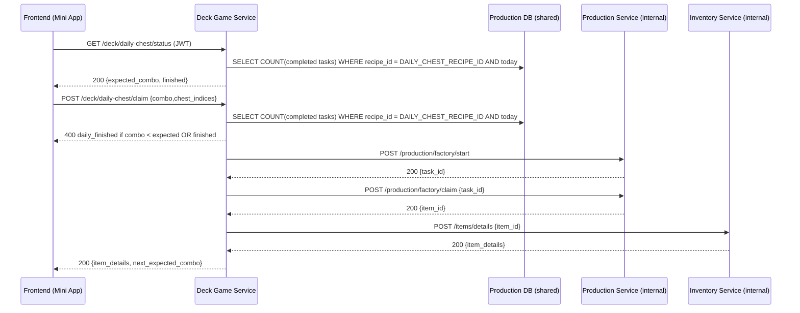

# Спецификация сервиса Deck Game Service (Мини-игра «Дека»)

## Обзор

Deck Game Service (далее — **DGS**) отвечает за игровую механику ежедневной выдачи сундуков в мини-игре «Дека». Сервис предоставляет публичный REST API для фронтенда, внутренний REST API для мониторинга и использует внутренние API production- и inventory-сервисов для мгновенного создания и получения наград.

**Ключевые возможности:**
1. Расчёт ожидаемого комбо для следующей награды (5 → 15).
2. Валидация и выдача награды за выполненное комбо с соблюдением cooldown.
3. Интеграция с Production Service для запуска рецептов и мгновенного claim.
4. Актуализация инвентаря игрока через Inventory Service.
5. JWT-аутентификация, rate limiting, метрики Prometheus, полное покрытие тестами.

**Порты по умолчанию:**
- `8080` — публичный API (`/deck/*`)
- `8090` — внутренний API (`/metrics`, `/health`)

**Зависимости:** PostgreSQL 17 (schema production), Redis 8 (проверка отзыва JWT), Production Service, Inventory Service.


## Глоссарий
| Термин | Описание |
|-------|----------|
| Combo | Количество совпавших карт, которое игрок собрал в раунде мини-игры |
| Daily Chest | Сундук, выдаваемый за выполнение combo, создаётся рецептом `DAILY_CHEST_RECIPE_ID` |
| Cooldown | Минимальное время между двумя успешными наградами, по умолчанию 30 сек |
| Crafts Count | Количество успешных крафтов сундука конкретным игроком за календарный день |


## Константы бизнес-логики
```text
DAILY_CHEST_RECIPE_ID = "9b9a4a62-7e79-4f1c-8dbe-62784be4c9d2"
COOLDOWN_DEFAULT_SEC  = 30
MAX_DAILY_CRAFTS      = 10
BASE_COMBO            = 5   // для 0 крафтов
MAX_COMBO             = 15  // для 10 крафтов (не выдаём сундуки)
```

Формула ожидаемого комбо:
```text
expected_combo = BASE_COMBO + crafts_count // crafts_count ∈ [0;9]
```
Если `crafts_count ≥ MAX_DAILY_CRAFTS` → награды на сегодня завершены.


## Потоки данных



## Публичный API
### 1. Получить статус ежедневных сундуков
`GET /deck/daily-chest/status`

| Параметр | Тип | Описание |
|----------|-----|----------|
| — | — | Нет query-параметров |

**Заголовки:** `Authorization: Bearer <jwt>`

**Ответ 200**
```json
{
  "expected_combo": 7,
  "finished": false,
  "crafts_done": 2,
  "last_reward_at": "2024-07-01T10:45:23Z"
}
```
Если `finished=true`, поле `expected_combo` опускается.

### 2. Заявить награду
`POST /deck/daily-chest/claim`

**Payload**
```json
{
  "combo": 8,
  "chest_indices": [1, 3]
}
```

**Требования к полю `chest_indices`:**
• Массив целых чисел от 1 до 6 включительно.  
• Должен содержать **как минимум один** индекс.  
• Дубли допускаются, порядок не важен.  
• На текущем этапе индексы не участвуют в бизнес-логике, проверяется только валидность значений.

**Ответ 200**
```json
{
  "items": [
    {
      "item_id": "359e86d5-d094-4b2b-b96e-6114e3c66d6b",
      "item_class": "chests",
      "item_type": "reagent_chest",
      "name": "Большой сундук реагентов",
      "description": "Содержит большое количество реагентов с максимальной выгодой.",
      "image_url": "/images/items/default.png",
      "collection": "base",
      "quality_level": "base",
      "quantity": 1
    }
  ],
  "next_expected_combo": 9,
  "crafts_done": 3
}
```

**Ошибки**
| Код | Короткое сообщение | Причина |
|-----|--------------------|---------|
| 400 | `invalid_combo` | Переданное `combo` < ожидаемого |
| 400 | `daily_finished` | Лимит 10 наград достигнут **или запрос пришёл раньше минимального интервала между наградами** |
| 404 | `recipe_not_found` | Константа `DAILY_CHEST_RECIPE_ID` неконсистентна |

### 3. Открыть сундуки
`POST /deck/chest/open`

**Описание:** Открывает указанный вид сундуков. Клиент может явно передать `quantity` либо указать `open_all: true`, чтобы открыть **все** сундуки данного типа и качества в инвентаре. Поля `quantity` и `open_all` взаимоисключающие – должно быть указано ровно одно. Если `open_all=true`, а подходящих сундуков нет, возвращается ошибка `insufficient_chests`.

**Payload**
```json
{
  "chest_type": "resource_chest",
  "quality_level": "medium",
  "open_all": true
}
```
_Либо_
```json
{
  "chest_type": "resource_chest",
  "quality_level": "medium",
  "quantity": 3
}
```

| Поле | Тип | Обяз. | Описание |
|------|-----|-------|----------|
| `chest_type` | `string` | да | Тип сундука (`resource_chest`, `reagent_chest`, `booster_chest`, `blueprint_chest`) |
| `quality_level` | `string` | да | Качество сундука (`small`, `medium`, `large`) |
| `quantity` | `integer` | да\* | Количество открываемых сундуков (1-100). **Указывать, если `open_all` = `false` или отсутствует** |
| `open_all` | `boolean` | да\* | Установите `true`, чтобы открыть все сундуки указанного вида. **Указывать, если `quantity` не передан** |

\*Должно быть задано ровно одно из полей `quantity` или `open_all`.

**Ответ 200**
```json
{
  "items": [/* … */],
  "quantity_opened": 3
}
```

**Ошибки**
| Код | Короткое сообщение | Причина |
|-----|--------------------|---------|
| 400 | `invalid_input` | Нарушено правило взаимоисключения quantity/open_all, некорректный диапазон quantity или другие валидации |
| 404 | `recipe_not_found` | Рецепт для такого сундука не найден |
| 400 | `insufficient_chests` | Недостаточно сундуков (например, `open_all=true`, но в инвентаре 0) |
| 500 | `internal_error` | Ошибка сервера или внешних сервисов |

### 4. Получить список товаров в магазине за сапфиры
`GET /deck/shop/sapphires`

**Описание:**
Возвращает список товаров, которые можно купить за сапфиры. В ответе только те рецепты, у которых на входе только сапфиры. Снятие ограничения по количеству выходных предметов позволяет получить все доступные товары.

**Параметры запроса:** —

**Ответ 200**
```json
[
  {
    "recipe_id": "1b7eac70-7c64-4b15-a73a-6d3b86dbea01",
    "code": "key_s_buy",
    "input": [
      {
        "item_id": "f1e2d3c4-b5a6-9788-4321-098765fedcba",
        "code": "sapphires",
        "quantity": 10
      }
    ],
    "output": {
      "item_id": "7e1d9e48-49cd-4ef2-b93e-1e32a0cb9a18",
      "code": "key",
      "quality_level_code": "small",
      "min_quantity": 1,
      "max_quantity": 1
    }
  },
  {
    "recipe_id": "4d0f3e11-1f9c-4b06-bc0d-9c6f099d66fb",
    "code": "blueprint_key_buy",
    "input": [
      {
        "item_id": "f1e2d3c4-b5a6-9788-4321-098765fedcba",
        "code": "sapphires",
        "quantity": 10000
      }
    ],
    "output": {
      "item_id": "4e25a5dc-a814-4102-b5cb-54c39fce969f",
      "code": "blueprint_key",
      "min_quantity": 1,
      "max_quantity": 1
    }
  }
]
```

**Поля ответа:**
- `recipe_id` - уникальный идентификатор рецепта
- `code` - код рецепта
- `input` - массив входящих предметов (только сапфиры)
  - `item_id` - ID предмета
  - `code` - код предмета
  - `collection_code` - код коллекции (опционально, не выводится для "base")
  - `quality_level_code` - код качества (опционально, не выводится для "base")
  - `quantity` - количество предметов, требуемое для рецепта
- `output` - выходной предмет
  - `item_id` - ID предмета
  - `code` - код предмета
  - `collection_code` - код коллекции (опционально, не выводится для "base")
  - `quality_level_code` - код качества (опционально, не выводится для "base")
  - `min_quantity` - минимальное количество предметов на выходе
  - `max_quantity` - максимальное количество предметов на выходе

**Примечания:**
- Поля `collection_code` и `quality_level_code` не включаются в ответ, если их значение равно "base" (значение по умолчанию)
- В массиве `input` всегда только сапфиры
- Количество выходных предметов не ограничено (убрано требование "только один предмет")

**Ошибки**
| Код | Сообщение | Причина |
|-----|-----------|----------|
| 500 | `internal_error` | Внутренняя ошибка сервиса |


## Покупка предмета (buyItem)

**POST /api/deck-game/buy-item**

Позволяет купить предмет по идентификатору рецепта или по коду товара (с указанием качества и серии).

### Входные параметры:
- `recipe_id` (uuid, optional) — идентификатор рецепта покупки
- `item_code` (string, optional) — код покупаемого предмета
- `quality_level_code` (string, optional) — качество (например, small/medium/large/base)
- `collection_code` (string, optional) — серия/коллекция (если применимо)
- `quantity` (int, optional, default=1) — количество

**Если передан только item_code (+ качество/серия), сервис ищет подходящий рецепт с operation_class_code: trade_purchase и output_items, соответствующим этим параметрам. Если найден ровно один рецепт — используется его id. Если не найден или найдено несколько — возвращается ошибка.**

### Логика:
1. Если передан recipe_id — используется он.
2. Если передан item_code — ищется подходящий рецепт.
3. Если найден ровно один рецепт — используется его id.
4. Далее отправляется запрос в production-service /factory/start с нужным количеством.
5. После успешного старта сразу вызывается /factory/claim для получения результата.
6. В ответе возвращается результат покупки или ошибка.

### Ответ:
- `items` — список купленных предметов (id, code, quality, collection, quantity)
- `error` — описание ошибки (если есть)

### Ошибки:
- `recipe_not_found` — не найден подходящий рецепт
- `recipe_ambiguous` — найдено несколько подходящих рецептов
- `production_error` — ошибка на этапе старта/клайма


## Внутренний API
| Метод | Роут | Описание |
|-------|------|----------|
| GET | `/health` | Liveness/Readiness |
| GET | `/metrics` | Prometheus |


## Хранение данных и вычисление прогресса

Deck Game Service не хранит собственную таблицу прогресса. Информация о выданных сундуках определяется запросом к БД Production Service:

```sql
SELECT COUNT(*)
  FROM production.production_tasks
WHERE user_id = :user_id
  AND recipe_id = :DAILY_CHEST_RECIPE_ID
  AND status = 'completed'
  AND completed_at::date = current_date;
```

Этот запрос возвращает количество успешных крафтов сундука за текущие сутки. Для расчёта `expected_combo` и проверки лимита используется именно это значение.


## Конфигурация (ENV)
| Переменная | По умолчанию | Описание |
|------------|--------------|----------|
| `PORT_PUBLIC` | `8080` | HTTP порт публичного API |
| `PORT_INTERNAL` | `8090` | HTTP порт внутреннего API |
| `DATABASE_URL` | — | PostgreSQL DSN (production schema) |
| `PRODUCTION_INTERNAL_URL` | `http://production-service:8090` | Внутренний порт 8090 (health/metrics, internal calls) |
| `PRODUCTION_EXTERNAL_URL` | `http://production-service:8080` | Публичные эндпоинты Production (start/claim) |
| `INVENTORY_INTERNAL_URL` | `http://inventory-service:8080` | Внутренние эндпоинты Inventory |
| `COOLDOWN_SEC` | `30` | Минимальный интервал между наградами |
| `DAILY_CHEST_RECIPE_ID` | см. выше | Идентификатор рецепта |
| `AUTH_PUBLIC_KEY_URL` | `http://auth-service:8090/public-key.pem` | Публичный RSA-ключ (PEM) от Auth Service |
| `REDIS_URL` | `redis://redis:6379/0` | Проверка отзыва токенов |


## Интеграции с другими сервисами

### Production Service
| Действие | HTTP | Тело |
|----------|------|------|
| Запуск задания | `POST /production/factory/start` | `{ "recipe_id": DAILY_CHEST_RECIPE_ID, "execution_count": 1 }` |
| Claim награды | `POST /production/factory/claim` | `{ "task_id": "<uuid>" }` |

Ответ `POST /production/factory/claim` соответствует схеме `ClaimResponse` Production Service. DGS берёт поле `items_received` и запрашивает подробные данные по каждому предмету через Inventory Service, формируя массив `items` (см. пример ответа выше).

### Inventory Service
| Действие | HTTP | Тело |
|----------|------|------|
| Получить локализованные данные предметов | `POST /items/details?lang=<ru\|en>` | `{ "items": [ { "item_id": "…" } ] }` |


## Безопасность
- Все публичные эндпоинты защищены JWT (RS256, валидация подписи с публичным ключом Auth Service).
- Внутренний API доступен только в сети docker-compose, mTLS по необходимости.
- Rate limiter: не более 20 POST `/deck/daily-chest/claim` в минуту на IP.


## Метрики (Prometheus)
| Метрика | Тип | Лейблы | Описание |
|---------|-----|--------|----------|
| `dgs_http_requests_total` | counter | `endpoint`,`method`,`status` | Счётчик запросов |
| `dgs_daily_craft_total`   | counter | `user_id` | Кол-во выданных сундуков |
| `dgs_invalid_combo_total` | counter | `user_id` | Ошибки `invalid_combo` |
| `dgs_cooldown_violation_total` | counter | `user_id` | Ранний запрос (cooldown) |
| `dgs_processing_latency_ms` | histogram | `endpoint` | Время обработки |

Grafana dashboard ID — TBD.


## Тестирование
1. **Unit-тесты**: бизнес-логика расчёта combo, cooldown, интеграция с Production stub (coverage ≥ 90%).
2. **Integration-тесты**: happy-path и edge-cases с test-containers PostgreSQL.
3. **E2E**: сценарии через public API + mock Production/Inventory.


## SLO
- **Availability** ≥ 99.5 % за 30 дней.
- **P95 latency** ≤ 120 мс для GET status, ≤ 250 мс для POST claim.


## Roadmap
- v1.0: реализовать описанные эндпоинты.
- v1.1: вынести Production call в async очередь для лучшей отказоустойчивости.
- v1.2: добавить геймификацию (leaderboard по combo).

---