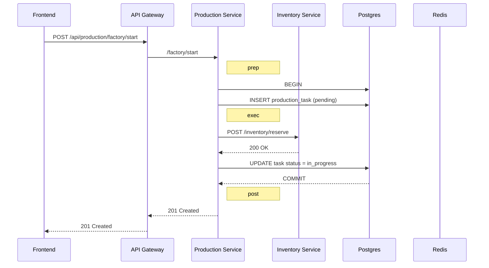

# Аудит Production Service

*Дата:* 27.06.2025
*Версия исходного кода:* ветка `develop`, commit текущей рабочей копии

## 1. Методология аудита

1. Изучены документы:
   - `docs/architecture/architecture.md` — системная архитектура
   - `docs/specs/production-service.md` — функциональная и техническая спецификация сервиса
2. Проанализирована структура проекта `services/production-service` и ключевые исходные файлы (слои `cmd`, `internal`, `pkg`).
3. Сравнены реализованные функции и интерфейсы с требованием спецификации и общими архитектурными принципами (Clean Architecture, PocketFlow, KISS).
4. Выявлены отклонения, риски и потенциальные зоны технического долга.
5. Подготовлены рекомендации по улучшению кода, архитектуры и процессов.

## 2. Высокоуровневый обзор реализации

### 2.1 Структура каталогов

- `cmd/server` — точка входа, сборка HTTP-сервера, инициализация зависимостей.
- `internal/handlers` — HTTP-обработчики (public, admin, internal).
- `internal/middleware` — кросс-концерн логирование, метрики, аутентификация.
- `internal/service` — бизнес-логика (task-, recipe-, modifier-, production-сервисы, HTTP-клиенты).
- `internal/storage` — репозитории PostgreSQL/Redis, абстрактные интерфейсы.
- `internal/database` — low-level клиенты к Postgres/Redis.
- `internal/adapters` — тонкие обёртки для инверсии зависимостей (DB, Cache, Metrics).
- `pkg/*` — переиспользуемые утилиты: логгер, метрики, JWT-валидатор.

Структура в целом соответствует Clean Architecture, однако наблюдаются места смешения ответственности (см. раздел «Нарушения слоёв» ниже).

### 2.2 Сопоставление с целевой архитектурой

| Компонент | Требование спецификации | Реализация | Оценка |
|-----------|------------------------|------------|--------|
| REST API маршруты | `/recipes`, `/factory/*`, префикс `/production` за шлюзом | В `main.go` роуты регистрируются под `/api/v1`. Префикс `/production` отсутствует, что приведёт к рассинхронизации с nginx-gateway | ❌ |
| JWT валидация | RS256 подпись, проверка отзыва в Redis, кеш PK | Реализовано через `pkg/jwt.Validator`, PK обновляется раз в 24 ч, кеш TTL задаётся — соответствует требованию | ✅ |
| Атомарность создания задания и резервирования инвентаря (п. 5–7 спецификации) | Транзакция должна охватывать запись задания + HTTP-вызов `/inventory/reserve` | В `task_service.go` операция распадается на DB-транзакцию **и** отдельный HTTP-запрос без механизмов компенсирующих откатов → возможна рассинхронизация | ❌ |
| Метрики | Экспорт через `/metrics`, бизнес-метрики слоёв | Основные системные метрики присутствуют, бизнес-метрики недостаточны (нет счётчиков Recipe/Task ошибок) | ⚠️ |

## 3. Положительные аспекты реализации

1. **Чёткое разделение слоёв** — наличие пакетов `handlers`, `service`, `storage` упрощает поддержку.
2. **Юнит-тесты** — тесты для калькулятора, сервисов и репозиториев повышают надёжность.
3. **Структурированное логирование** с использованием `zap`, единый лог-левел из конфигурации.
4. **Интеграция Prometheus**: middleware собирает HTTP-метрики, экспорт `/metrics`.
5. **DI через конструкторы** — зависимости передаются явно, что облегчает тестирование.

## 4. Предварительный список проблем (будет расширяться)

| № | Категория | Краткое описание |
|---|-----------|------------------|
| P-1 | API контракт | Несоответствие префикса URL (`/production`) — нарушает маршрутизацию через API Gateway |
| P-2 | Транзакционность | Отсутствует атомарность между созданием задания и резервированием инвентаря, что может привести к «зависшим» задачам |
| P-3 | Слои | В `task_service` осуществляется HTTP-вызов внешних сервисов внутри бизнес-логики без адаптера-интерфейса, нарушая принцип SRP |
| P-4 | Observability | Недостаточно бизнес-метрик (статусы заданий, ошибки резервирования) |
| P-5 | Конфиг-менеджмент | Параметры сервисов захардкожены в конфиге, нет поддержки переменных окружения для всех полей |
| P-6 | Тестовое покрытие | Некоторые критичные пути (factory handlers, middleware.Auth) не покрыты тестами |
| P-7 | PocketFlow | Не всегда соблюдена схема prep-exec-post; ряд функций совмещают подсчёт, запись в БД и запросы во внешние сервисы |

## 5. Детальный разбор ключевых проблем

### 5.1 P-1 — Несоответствие API-контракта (URL-префикс)

**Факты**  
1. API Gateway (файл `deploy/dev/api-gateway/nginx.conf`) проксирует Production Service под путём `/production/*`:
   ```nginx
   location /production/ {
       proxy_pass http://production_service/;
   }
   ```
2. В коде `cmd/server/main.go` корневые маршруты регистрируются под `/api/v1` и не имеют дополнительного базового префикса `/production`:
   ```go
   r.Route("/api/v1", func(r chi.Router) { /* ... */ })
   ```
3. Согласно архитектуре в `docs/architecture/architecture.md` внешний путь должен быть `/api/production/*`.  Внешний nginx отрезает `/api`, внутренний Gateway оставляет `/production/*`, который далее должен попадать в сервис **как относительный путь** (т.е. `/recipes`, `/factory/start` и т.д.).  
4. В текущей реализации при запросе клиента `GET /api/production/recipes` сервис получит путь `/production/recipes`, но роутер ожидает `/api/v1/recipes` → 404.

**Риски**  
- Непредсказуемые 404 в проде.  
- Требуется лишняя конфигурация либо на шлюзе, либо в сервисе, что усложняет DevOps.

**Рекомендации**  
1. **Унифицировать префикс**. Самый простой вариант — убрать внутренний префикс `/api/v1` из сервиса и регистрировать маршруты на корне «/». Версионность можно оставить в названии nginx-location (`/v1/production`) или через заголовок.  
2. Если версия обязана быть частью URL, настроить rewrite в nginx:  
   ```nginx
   location /production/ {
       rewrite ^/production/(.*)$ /api/v1/$1 break;
       proxy_pass http://production_service/;
   }
   ```
3. Добавить **integration-test** (e2e) на уровень Gateway→Service для проверки корректности роутинга; запускать в CI.
4. Обновить документацию OpenAPI в `docs/specs/production-service.md`, чтобы она отражала окончательный URL-шаблон.

### 5.2 P-2 — Отсутствие атомарности при создании задания и резервировании инвентаря

**Требование спецификации**  
Пункты 5–7 гласят: создание задачи (DB) и вызов `POST /inventory/reserve` должны быть **единой атомарной операцией**; при любой ошибке задание не создаётся, резервы откатываются.

**Реализация**  
Функция `createTaskWithReservation` (`internal/service/task_service.go`) выполняет операции последовательно:
```go
err := s.taskRepo.CreateTask(ctx, task)         // (1) INSERT
...
err = s.inventoryClient.ReserveItems(ctx, ...)  // (2) HTTP call
if err != nil {
    _ = s.taskRepo.UpdateTaskStatus(ctx, task.ID, models.TaskStatusFailed) // компенсация?
    return fmt.Errorf("failed to reserve items: %w", err)
}
```
Очевидные проблемы:
1. **Нет транзакции БД** — между (1) и (2) возможен краш; задача останется «pending» без резервов → вечная блокировка слота.
2. **Слабая компенсация** — статус меняется на `failed`, но запись остаётся; спецификация требует полного отката создания.
3. **Нет отката резерва** — если `inventory` зарезервировал часть предметов и упал, данные расходятся.

**Риски**  
- Потеря материалов или «зависшие» задания.  
- Неустранимые расхождения между инвентарём и производством.  
- Сложность последующего аудита и восстановления баланса.

**Рекомендации**
1. **Сага (Saga pattern)**  
   Использовать паттерн саги с явными шагами — `CreateTask(pending) → ReserveItems → ConfirmTask(active)`.
   - Запись создаётся в статусе *draft/pending* внутри транзакции.
   - После успешного резерва вызывается `taskRepo.ConfirmTask(...)` (изменение статуса).  
   - При ошибке вызывается `inventoryClient.RollbackReserve(...)` и `taskRepo.DeleteTask(...)`.
2. **Транзакция PostgreSQL + Outbox**  
   - Сохранять событие «task_created» в таблице `outbox_events` в той же транзакции, что и запись задачи.  
   - Фоновый publisher читает `outbox_events` и вызывает Inventory Service.  
   - Достигается гарантированная «at-least-once» доставка без 2PC.
3. **Компенсационные endpoint-ы**  
   В Inventory Service уже предусмотрены `return-reserve` и `consume-reserve`; использовать их при ошибках.
4. **Валидация индемпотентности**  
   Все внешние вызовы (`reserve`, `return-reserve`) должны принимать `operation_id` (UUID задачи) и быть идемпотентными.
5. **Тестирование**  
   - Добавить unit-test, проверяющий, что при симулированном `ReserveItems` ошибка запись задачи удаляется.  
   - Интеграционный тест: запуск производственного процесса с искусственным падением Inventory Service.
6. **Обновить документацию**: описать механизм саги и схему /sequence diagram.

> **Быстрая фиксация (MVP)**: обернуть (1) и (2) в транзакцию `BEGIN; INSERT ...; COMMIT;` *и* добавить последующий `DELETE` при ошибке резерва. Это не решит crash-loop, но снизит вероятность рассинхронизации.

### 5.3 P-3 — Нарушение слоёв и принципов SRP/DI

**Наблюдения**
1. Бизнес-сервис `TaskService` (файл `internal/service/task_service.go`)
   - напрямую вызывает `s.taskRepo` (Postgres) **и** `s.inventoryClient` / `s.userClient` (HTTP) внутри одного метода `StartProduction`.
   - содержит алгоритмы модификаторов, расчёт выходных предметов, работу со слотами *и* сетевые запросы.
2. HTTP-клиенты `inventory_client.go`, `user_client.go` находятся в том же пакете `service` — таким образом «service» выступает как доменный слой *и* инфраструктурный одновременно.
3. `ModifierService` и `ProductionCalculator` импортируют `storage.ClassifierRepository`, тем самым доменная логика зависит от слоя доступа к данным.
4. В пакете `internal/adapters` уже есть примитивные адаптеры DB/Cache, но нет adapter-обёрток для внешних сервисов (Inventory/User).  

**Последствия**
- Пониженная тестируемость: для unit-тестов TaskService приходится мокировать HTTP-клиенты и репозитории одновременно.
- Нарушение Clean Architecture: доменные правила зависят от деталей хранения/транспорта.
- Сложность повторного использования ProductionCalculator в других сервисах/воркерах.

**Рекомендации**
1. **Выделить Ports & Adapters**
   - Создать интерфейсы `InventoryPort`, `UserPort` в пакете `domain` или `ports`.
   - Реализация HTTP переезжает в `adapter/http/inventory` и `adapter/http/user`.
   - TaskService принимает только эти интерфейсы.
2. **Разделить Use-Case и Infrastructure**: переместить логику расчёта (calculator, modifier) в пакет `domain`, репозиторий в `adapter/postgres`.
3. **Внедрение зависимостей (DI)** через конструктор в `cmd/server` как сейчас, но с чистыми интерфейсами.
4. **Слой Prep–Exec–Post (PocketFlow)**
   - `prep`: валидация, получение лимитов, расчёт; не должно обращаться к внешним сервисам.
   - `exec`: транзакция + вызовы внешних портов.
   - `post`: логирование, метрики.
5. **Refactor Roadmap**
   - Шаг 1: ввести интерфейсы и вынести HTTP-клиентов в `internal/adapters`.
   - Шаг 2: переместить калькулятор в отдельный пакет `domain/calculation`.
   - Шаг 3: разбить `TaskService` на `TaskUseCase` (clean) и orchestrator/saga (infra).

### 5.4 P-4 — Observability (Метрики и Логирование)

**Текущее состояние**
- Middleware `internal/middleware/metrics.go` публикует базовые HTTP-метрики (`production_http_requests_total`, duration).
- В `pkg/metrics` определён богатый набор счётчиков/histogramов (ProductionTasksTotal, RecipeUsageTotal, etc.), **но они нигде не инкрементируются** (поиск `metrics.RecordProductionTask` показал 0 использований).
- Отсутствуют логи в критических местах (например, при откате резервов).

**Риски**
- Невозможно построить дашборды по успешности/ошибкам производственных операций.
- Трудно локализовать проблемы с рецептами или лимитами.

**Рекомендации**
1. **Интегрировать бизнес-метрики**
   - В `TaskService.StartProduction` после успешного создания: `metrics.RecordProductionTask(recipe.ID.String(), "pending")`.
   - После перехода в `in_progress`, `completed`, `claimed` — аналогичные вызовы.
   - При ошибке резервирования: `metrics.RecordProductionTask(recipe.ID.String(), "failed")`.
2. **Recipe Usage**: каждый запуск `StartProduction` инкрементировать `metrics.RecordRecipeUsage`.
3. **Duration Metrics**: при завершении задания — `metrics.RecordProductionTaskDuration` (f→t).
4. **Inventory API**: обернуть клиента декоратором, логировать `metrics.RecordInventoryAPICall`.
5. **Structured Logs**
   - Добавить `zap.String("operation_id", task.ID.String())` во все логи сопряжённых сервисов.
   - Логировать результат `ReserveItems`, включая список недостающих предметов.
6. **Dashboards**: расширить Grafana board `production-service-metrics.json` (TBD).

### 5.5 P-5 — Конфиг-менеджмент и параметры окружения

**Наблюдения**
- Файл `internal/config/config.go` загружает переменные окружения через `getEnv`, предоставляя _дефолтные значения_ (например, `DATABASE_URL` по умолчанию пустой строке, Redis — тоже).
- При валидации проверяется только `Database.URL` и `Redis.URL`; остальные критичные поля (PublicKeyURL, Service URLs) могут остаться дефолтными и уйти в прод.
- Конфиг в Dockerfile/Compose не использует единого префикса (часть переменных `PRODUCTION_SERVICE_`, часть общие).
- Нет поддержки **конфиг-файлов** (yaml/json), отсутствует механизм перехота конфигурации без рестарта.
- Отсутствуют типизированные подконфиги для метрик, feature flags.

**Риски**
- Ошибки конфигурации остаются незамеченными до рантайма (например, неверный URL Inventory Service).
- «Сюрпризные» дефолты (Redis база по умолчанию) → баги в проде.
- Отсутствие единой схемы мешает операторам и CI/CD pipeline.

**Рекомендации**
1. **Fail-fast Policy**: убрать дефолты для обязательных полей; приложение должно падать при отсутствии требуемых переменных.
2. **Конвенция имён**: все переменные окружения начинать с `PROD_SVC_` (или `SLCW_PROD_`).
3. **Поддержка YAML**: разрешить загрузку `config.yml` + override через env; применить библиотеку `github.com/spf13/viper`.
4. **Секреты**: чувствительные поля (DB/Redis пароли, JWT ключ) передавать через Docker secrets / Vault, а не env.
5. **Dynamic Reload**: рассмотреть SIGHUP/reload для non-critical полей (уровень логирования).
6. **Документация**: добавить раздел *Configuration* в `README.md` сервиса.

### 5.6 P-6 — Тестовое покрытие

**Состояние**
- Присутствуют unit-тесты для:
  - Calculator, Modifier, TaskService (basic/simple/claim) — ~80% логики расчётов.
  - Repository (Postgres) — базовые CRUD.
  - Middleware (metrics) покрытие отсутствует.
- Отсутствуют тесты для HTTP-слоя (`handlers`), JWT-middleware, Redis-операций.
- Нет e2e-тестов (заказ ↔ inventory), нет контракт-тестов API.

**Риски**
- Регрессия маршрутов (см. P-1) не ловится в CI.
- Ошибки интеграции с Inventory/User остаются незамеченными до staging.

**Рекомендации**
1. **Coverage KPI**: целевое покрытие ≥80 % на each пакет, исключая generated.
2. **Handler Tests**: использовать `httptest` + mock jwt.Validator для `/factory` и `/recipes` endpoint-ов.
3. **Middleware Tests**: проверить логирование и метрики (assert на зарегистрированные Prometheus metrics).
4. **Integration Tests**: docker-compose в CI (`make test-integration`) поднимает Inventory mock, проверяет полный happy-path.
5. **Contract Tests**: pact-based проверка взаимодействия Production ↔ Inventory/User.
6. **Test Build Tag**: вынести фейковые реализации (mock clients) в `_test.go` файлы.

### 5.7 P-7 — PocketFlow (prep → exec → post)

**Концепт**: Внутренний стандарт проекта требует, чтобы каждая бизнес-операция имела три чётких этапа:  
`prep` — подготовка данных, валидация, расчёты;  
`exec` — единственный побочный эффект (транзакция, вызов внешних сервисов);  
`post` — уведомления, метрики, логирование.

**Выявленные нарушения**
- В методе `StartProduction` все три этапа переплетены:
  - `prep`: валидация лимитов, расчёт калькулятора.
  - **Смешение**: создание записи в БД (side-effect) происходит **до** вызова `ReserveItems`, а логирование модификаторов — внутри одной функции.
- Метод `processTaskClaim` аналогично сочетает в себе обновление БД, вызовы Inventory и формирование ответа.

**Рекомендации**
1. **Структурировать код в три функции**: `prepareStart`, `executeStart`, `postStart`. Это повысит читаемость и облегчит ретраи.
2. **Единый побочный эффект**: в `exec` должна быть либо транзакция БД, либо вызов саги, но не оба одновременно — часть побочных эффектов должна быть перенесена в orchestrator.
3. **Failsafe post**: метрики и логи должны выполняться в `defer`-блоке, чтобы гарантировать отправку даже при ошибке.
4. **Документация**: включить sequence diagram (см. ниже) в `docs/architecture/pocketflow/production-start.md`.

**Пример рефакторинга**
```go
func (uc *TaskUseCase) StartProduction(ctx context.Context, cmd StartCommand) (*Task, error) {
    data, err := uc.prep(ctx, cmd)
    if err != nil { return nil, err }

    task, err := uc.exec(ctx, data)
    uc.post(ctx, task, err) // всегда вызывается
    return task, err
}
```

**Диаграмма последовательностей (целевая модель)**



---

## 6. Итоговые рекомендации

1. **Выравнять API-контракт** (P-1) — критично для выпуска.
2. **Реализовать атомарную сагу** (P-2) — исключить расхождения данных.
3. **Рефактор слоёв** (P-3) — перейти к Ports & Adapters, подготовиться к масштабированию.
4. **Расширить observability** (P-4) — внедрить бизнес-метрики, структурные логи.
5. **Упорядочить конфиги** (P-5) — fail-fast, секреты, конвенции.
6. **Повысить тест-покрытие** (P-6) — добавить e2e и контрактные тесты.
7. **PocketFlow & Docs** (P-7) — проверить соблюдение prep-exec-post, обновить sequence diagrams.

Приоритизация: P-1 и P-2 — blocker перед релизом; P-3/P-4 — в следующих двух спринтах; P-5/P-6 — параллельно с рефакторингом. 

---

*Конец отчёта.* 